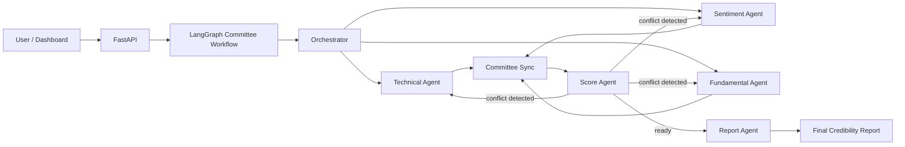

# Equity Intelligence Graph

AI-powered stock credibility analysis system built with **FastAPI**, **LangGraph**, **LangChain integrations**, and free market/news data sources.

The system evaluates a stock through a multi-agent analyst committee rather than a rigid prediction pipeline. Technical, sentiment, and fundamental agents produce independent views, a score arbiter resolves conflicts, and a report agent generates an analyst-style summary.

> Educational and research use only. This project does not provide financial advice.

## Highlights

- Multi-agent orchestration with LangGraph
- Shared state, message passing, conditional routing, and iterative re-analysis
- Technical analysis from Yahoo Finance OHLCV data
- News sentiment analysis from Google News RSS
- Fundamental analysis from Yahoo Finance company metrics
- Rule-based score arbitration instead of simple averaging
- Groq-first LLM report generation with fast deterministic fallback
- Modern dark FastAPI-served dashboard
- CLI and REST API support
- Cloud-friendly deployment profile for Render, Railway, and Docker
- Optional local research stack for ChromaDB, transformers, XGBoost, LightGBM, MLflow, Ollama, and Hugging Face

## System Architecture



The graph is intentionally not a strict one-way DAG. Agents write to shared state, the committee synchronizes analyst outputs, and the score arbiter can request another analyst round when conflicts are material.

## Agents

| Agent | Responsibility | Data Source |
|---|---|---|
| Technical Agent | RSI, MACD, EMA/SMA alignment, volatility, volume, support/resistance | Yahoo Finance via `yfinance` |
| Sentiment Agent | Headline sentiment, narrative extraction, topic signals | Google News RSS |
| Fundamental Agent | PE, debt/equity, ROE, revenue growth, market cap, margins | Yahoo Finance via `yfinance` |
| Score Agent | Dynamic weighting, conflict detection, final credibility score | Agent outputs |
| Report Agent | Final analyst-style written summary | Groq or fallback generator |

## Project Structure

```text
stock_credibility_ai/
  agents/
    technical_agent.py
    sentiment_agent.py
    fundamental_agent.py
    score_agent.py
    report_agent.py
  api/
    app.py
    static/
      index.html
      styles.css
      app.js
  data/
    market_data.py
    news_data.py
    preprocessing.py
  graph/
    state.py
    workflow.py
    router.py
  memory/
    chroma_memory.py
    sqlite_store.py
  models/
    technical_model.py
    sentiment_model.py
    arbitration_model.py
  utils/
    config.py
    llm.py
    logging.py
```

## Quickstart

### 1. Create environment

```bash
python -m venv .venv
```

Windows:

```bash
.venv\Scripts\activate
```

macOS/Linux:

```bash
source .venv/bin/activate
```

### 2. Install cloud-friendly dependencies

```bash
pip install -r requirements.txt
```

### 3. Configure environment

```bash
copy .env.example .env
```

For macOS/Linux:

```bash
cp .env.example .env
```

Minimum recommended `.env`:

```env
LLM_PROVIDER=groq
GROQ_API_KEY=your_groq_api_key_here
GROQ_MODEL=llama-3.1-8b-instant
ENABLE_LLM_REPORT=true
REPORT_LLM_TIMEOUT_SECONDS=8
ENABLE_TRANSFORMERS=false
ENABLE_CHROMA_MEMORY=false
```

The app still works without `GROQ_API_KEY`; it uses a deterministic fallback report.

## Run Locally

### Dashboard and API

```bash
uvicorn stock_credibility_ai.api.app:app --reload
```

Dashboard:

```text
http://127.0.0.1:8000/
```

API docs:

```text
http://127.0.0.1:8000/docs
```

### CLI

```bash
python -m stock_credibility_ai AAPL
python -m stock_credibility_ai RELIANCE.NS --period 6mo
```

## API Usage

Endpoint:

```http
POST /analyze
```

Request:

```json
{
  "ticker": "AAPL",
  "period": "1y",
  "interval": "1d",
  "max_iterations": 2
}
```

Example:

```bash
curl -X POST http://127.0.0.1:8000/analyze \
  -H "Content-Type: application/json" \
  -d '{"ticker":"AAPL","period":"1y","interval":"1d","max_iterations":2}'
```

Response includes:

- final credibility score
- market bias
- confidence
- agent-level analysis
- conflict list
- dynamic arbitration weights
- final report narrative

## Configuration

| Variable | Default | Description |
|---|---:|---|
| `LLM_PROVIDER` | `groq` | LLM provider for report generation |
| `GROQ_API_KEY` | empty | Groq API key |
| `GROQ_MODEL` | `llama-3.1-8b-instant` | Groq model name |
| `ENABLE_LLM_REPORT` | `true` | Enables hosted LLM narrative generation |
| `REPORT_LLM_TIMEOUT_SECONDS` | `8` | Hard timeout for report generation |
| `ENABLE_TRANSFORMERS` | `false` | Enables local transformer sentiment model |
| `ENABLE_CHROMA_MEMORY` | `false` | Enables ChromaDB memory |
| `SQLITE_PATH` | `./runtime/stock_credibility.sqlite3` | Local report audit database |
| `CHROMA_PATH` | `./runtime/.chroma` | ChromaDB persistence path |
| `LOG_LEVEL` | `INFO` | Application log level |

For the fastest hosted demo, disable LLM reports:

```env
ENABLE_LLM_REPORT=false
```

This avoids network latency during the final report stage.

## Deployment

The default `requirements.txt` is optimized for cloud deployment. Heavy local research dependencies are kept in `requirements-full.txt`.

### Required Production Variables

```env
LLM_PROVIDER=groq
GROQ_API_KEY=your_groq_api_key_here
GROQ_MODEL=llama-3.1-8b-instant
ENABLE_TRANSFORMERS=false
ENABLE_CHROMA_MEMORY=false
REPORT_LLM_TIMEOUT_SECONDS=8
```

### Start Command

```bash
uvicorn stock_credibility_ai.api.app:app --host 0.0.0.0 --port $PORT
```

### Render

This repo includes `render.yaml`.

Manual setup:

- Service type: Web Service
- Build command: `pip install -r requirements.txt`
- Start command: `uvicorn stock_credibility_ai.api.app:app --host 0.0.0.0 --port $PORT`
- Add `GROQ_API_KEY` in environment variables

### Railway

This repo includes a `Procfile`.

Steps:

- Deploy from GitHub
- Add `GROQ_API_KEY` in Variables
- Railway should detect the `Procfile`

### Docker

```bash
docker build -t equity-intelligence-graph .
docker run -p 8000:8000 --env-file .env equity-intelligence-graph
```

## Optional Full Research Stack

Install optional local ML and memory tooling:

```bash
pip install -r requirements-full.txt
```

This adds:

- Ollama and Hugging Face LangChain integrations
- ChromaDB
- transformers
- sentence-transformers
- scikit-learn
- XGBoost
- LightGBM
- MLflow

## Current Implementation Status

Implemented:

- LangGraph committee workflow
- Async agent execution
- Shared state and message passing
- Technical, sentiment, and fundamental agents
- Rule-based score arbitration
- Conflict-aware re-analysis loop
- Groq report generation with timeout and fallback
- FastAPI dashboard and REST API
- SQLite report audit storage
- Cloud deployment configuration

Planned extensions:

- Learned meta-arbitration model
- Sector-aware scoring profiles
- Market regime detection
- Backtesting harness
- Persistent hosted database
- User feedback loop for score calibration

## Limitations

- Free data sources can be delayed, incomplete, or rate-limited.
- yfinance fields vary by ticker and exchange.
- Google News RSS headlines are not a complete news corpus.
- The score is an explainability-oriented credibility signal, not a price target.
- This project is not financial advice.

## License

Choose a license before publishing if you want others to reuse the code. MIT is a common choice for open-source demos.
