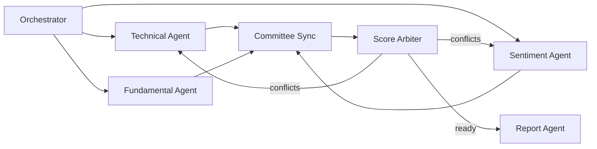

# Stock Credibility AI

A production-style, local-first stock credibility analysis system built with Python, LangChain, LangGraph, and FastAPI.

The project is designed to behave like an investment committee: multiple semi-independent analyst agents inspect the same stock from different angles, write into shared state, and let a score arbiter resolve conflicting views. It is not a rigid prediction pipeline and it does not use paid market data.

## Agents

- Technical Agent: RSI, MACD, EMA/SMA alignment, Bollinger context, volatility, volume, and support/resistance.
- Sentiment Agent: Google News RSS headlines with FinBERT when enabled, or a lightweight local lexicon fallback.
- Fundamental Agent: yfinance fundamentals such as PE ratio, debt/equity, ROE, revenue growth, market cap, and margins.
- Score Agent: rule-based arbitration with conflict detection and optional re-analysis requests.
- Report Agent: analyst-style narrative using Ollama, Groq, Hugging Face, or deterministic fallback text.

## Why This Is Not A Strict DAG

The LangGraph workflow fans out to analyst agents, merges their shared state at a committee sync point, and lets the Score Agent request targeted re-analysis when signal conflicts are large. That loop allows agent views to evolve instead of forcing a fixed one-pass sequence.



## Setup

```bash
python -m venv .venv
.venv\Scripts\activate
pip install -r requirements.txt
```

Optional `.env`:

```env
LLM_PROVIDER=ollama
OLLAMA_MODEL=qwen2.5:7b
ENABLE_TRANSFORMERS=false
CHROMA_PATH=./.chroma
```

For local LLM reporting, install Ollama and pull a free/open model:

```bash
ollama pull qwen2.5:7b
```

The system still runs without an LLM. It will use deterministic fallback reporting.

## Run From CLI

```bash
python -m stock_credibility_ai AAPL
python -m stock_credibility_ai RELIANCE.NS --period 6mo
```

## Run API

```bash
uvicorn stock_credibility_ai.api.app:app --reload
```

Open the dashboard:

```text
http://127.0.0.1:8000/
```

The API docs remain available at:

```text
http://127.0.0.1:8000/docs
```

You can also POST:

```json
{
  "ticker": "AAPL",
  "period": "1y",
  "interval": "1d",
  "max_iterations": 2
}
```

to:

```text
http://127.0.0.1:8000/analyze
```

## Phase Roadmap

Phase 1 is implemented:

- Working LangGraph orchestration
- Shared state and message passing
- Async analyst execution where LangGraph can schedule parallel branches
- Rule-based technical, sentiment, fundamental, and score arbitration
- Local/open LLM support with fallback reporting
- FastAPI endpoint
- SQLite audit storage for completed reports

Phase 2 extension points:

- Replace `models/technical_model.py` with an XGBoost or LightGBM trend confidence model.
- Extend `models/arbitration_model.py` into a learned meta-model.
- Persist analyst memory in ChromaDB with richer embeddings and retrieval prompts.

Phase 3 extension points:

- Market regime detector.
- User feedback and reinforcement loop.
- Dynamic sector-aware weighting.

## Notes

This project is for research and educational workflows only. It is not financial advice. Free data sources such as yfinance and Google News RSS may be delayed, incomplete, or rate-limited.
